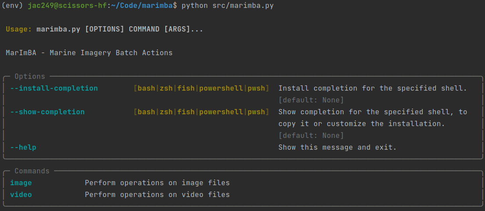

<a name="readme-top"></a>

<!-- PROJECT LOGO -->
<figure markdown style="text-align: center">


</figure>

<div style="text-align: center">

<h1 style="color: #00A9CE">MarImBA</h1>
<h3><span style="color: #00A9CE">Mar</span>ine <span style="color: #00A9CE">Im</span>agery <span style="color: #00A9CE">B</span>atch <span style="color: #00A9CE">A</span>ctions</h3>
<p><i>A Python CLI for batch processing, transforming and FAIR-ising large volumes of marine imagery.</i></p>
<div>
  <a href="https://github.com/elangosundar/awesome-README-templates/stargazers"></a>
<a href="https://github.com/elangosundar/awesome-README-templates/network/members"></a>
<a href="https://github.com/elangosundar/awesome-README-templates/pulls"></a>
<a href="https://github.com/elangosundar/awesome-README-templates/issues"></a>
<a href="https://github.com/elangosundar/awesome-README-templates/graphs/contributors"></a>
<a href="https://github.com/elangosundar/awesome-README-templates/blob/master/LICENSE"></a>
</div>
(all badges show example values, but will show real values when this project is open-sourced)
<br>
</div>


This repository contains the MarImBA Python CLI (Command Line Interface) which is a scientific marine image processing library initially develop at [CSIRO](https://www.csiro.au/). MarImBA is based on the [Typer](https://typer.tiangolo.com/) and [Rich](https://pypi.org/project/rich/) Python packages and contains a range of capabilities including:

* File renaming and directory structuring using pipeline-specific naming conventions
* Integration with the [iFDO](https://marine-imaging.com/fair/ifdos/iFDO-overview/) (image FAIR Digital Object) standards
* Image conversion, compression and resizing using Python [Pillow](https://pypi.org/project/Pillow/)
* Video transcoding, chunking and frame extraction using [Ffmpeg](https://ffmpeg.org/)
* Automated logfile capturing to archive image processing provenance

MarImBA can be used directly after data acquisition has occurred and can efficiently produce well-described image datasets that are aligned with the FAIR data standards.

---

## Contents

- [Getting started](#getting-started)
  - [Install](#install)
  - [Project structure](#project-structure)
  - [Set up Poetry envionment](#python-poetry)
  - [Build](#poetry-build)
- [Usage](#usage)
- [Contributing](#contributing)
- [License](#license)
- [Contact](#contact)
- [Acknowledgments](#acknowledgments)

---

<a name="getting-started"></a>
## Getting started

<a name="install"></a>
### Install

MarImBA has a few system level dependencies such as `ffmpeg` and `ffprobe` (which is installed with `ffmpeg`) (it would be very nice to move away from this, especially if we can find a cross-platform pip ffmpeg library!). On Ubuntu you can install `ffmpeg` with:

```bash
sudo apt install ffmpeg
```

Then clone the MarImBA repository:

```bash
git clone https://bitbucket.csiro.au/scm/biaa/marimba.git
```

In the future we are anticipating making MarImBA an official [PyPI](https://pypi.org/) package, which will be installable with `pip install marimba` and usable anywhere on your system.


<a name="project-structure"></a>
### Project structure

We have structured the code in this project guided loosely by the following articles:

* [The optimal python project structure](https://awaywithideas.com/the-optimal-python-project-structure/)
* [Structuring Your Project — The Hitchhiker's Guide to Python](https://docs.python-guide.org/writing/structure/)

The specific structure for this project is:

```
marimba
└───doc                         - Documentation files for MarImBA
└───img                         - Images for this README.md file
└───marimba                     - Source directory containing the MarImBA Python CLI application code
│   │
│   └───naming                  - File naming schemes for different pipelines
│   └───utils                   - Utility modules
│   │   │   file_system.py      - File system tools
│   │   │   logger_config.py    - Logging configuration settings
│   │
│   │   marimba.py              - Main Python application
│   │   config.py               - General application-wide configuration settings
│
└───tests                       - Unit tests for the application
│
│   .flake8                     - Custom flake8 settings
│   .pre-commit-config.yaml     - Pre-commit hooks that can be executed locally and in CI
│   Dockerfile                  - Main Dockerfile to build MarImBA in a Docker container
│   pyproject.toml              - Custom Python Black settings
│   README.md                   - This file!
│   requirements.txt            - Pip dependencies for Python virtual environment
```


<a name="python-poetry"></a>
### Set up Poetry envionment

Let's install the Python dependencies into a virtual environment using [Poetry](https://python-poetry.org/). If you don't have Poetry installed, you can install it with:

```bash
pip install poetry
```

Then, from the root directory of the MarImBA project, run:

```bash
poetry install
poetry shell
```

This will create a new environment, install the package dependencies and activate the environment. You can now run the MarImBA CLI application from the activated environment:

```bash
marimba --help
```


<a name="poetry-build"></a>
### Build

To build MarImBA application as a Python wheel, run:

```bash
poetry build
```

This will create a `dist` directory containing the built wheel package. You can then install the package anywhere with pip, e.g.:

```bash
pip install dist/marimba-0.1.0-py3-none-any.whl
```

<p align="right">(<a href="#readme-top">back to top</a>)</p>

---

<a name="usage"></a>
## Usage

MarImBA is based on the [Typer](https://typer.tiangolo.com/) Python package which is self-documenting by default. Try running MarImBA to see the default help menu:

```bash
marimba
```



The default entry point to start using MarImBA is the `new` command. This allows you to create a new MarImBA collection, pipeline or deployment that adheres to the following standard MarImBA structure:

```
{collection}
│
└───distribution                    - 
│
└───pipelines                     - 
│   │
│   └───{pipeline}                - 
│       │
│       └───lib                     - 
│       │   │   pipeline.py       - 
│       │   │   requirement.txt     - 
│       │
│       └───work                    - 
│       │   │
│       │   └───{deployment}        - 
│       │
│       │   {pipeline}.log        - 
│       │   pipeline.yml          - 
│       │   metadata.yml            - 
│
└───collection.yml                  - 
└───{collection}.log                - 
```

The usual order you might use the MarImBA commands might be:
* `marimba new {collection}`
* `marimba new {pipeline}`
* `marimba new {deployment}`
* `marimba qc` - it applicable
* `marimba rename`
* `marimba metadata`
* `marimba convert`
* `marimba distribute`
* ...


<p align="right">(<a href="#readme-top">back to top</a>)</p>

---

<a name="contributing"></a>
## Contributing

This is an open-source project and we welcome contibutions. If you have a suggestion that would make MarImBA better, please clone the repo and submit a pull request.

1. Clone the project: <a href="#getting-started">Getting Started</a>
2. Create your new feature branch: 
    ```bash
    git checkout -b feature/amazing-feature
    ```
4. Commit your changes: 
    ```bash
    git commit -m 'Added some amazing feature'
    ```
5. Push to the branch: 
    ```bash
    git push origin feature/amazing-feature
    ```
6. Open a pull request

<p align="right">(<a href="#readme-top">back to top</a>)</p>

---

<a name="license"></a>
## License

This project is licensed under [MIT](https://opensource.org/licenses/MIT) license.

(TODO: This needs to be reviewed according to CSIRO current licensing recommendations. There was recently an interesting thread on the MS Teams linux channel [here](https://teams.microsoft.com/l/message/19:f76b576ac1df4742a7a8cb5c2a86439d@thread.skype/1673393871094?tenantId=0fe05593-19ac-4f98-adbf-0375fce7f160&groupId=20e7492d-eca3-4f55-bbc6-e87f2ad12df2&parentMessageId=1673393871094&teamName=CSIRO&channelName=linux&createdTime=1673393871094&allowXTenantAccess=false))

<p align="right">(<a href="#readme-top">back to top</a>)</p>

---

<a name="contact"></a>
## Contact

The primary point-of-contact for this repository is: 
* Chris Jackett - [chris.jackett@csiro.au](mailto:chris.jackett@csiro.au)

<p align="right">(<a href="#readme-top">back to top</a>)</p>

---

<a name="acknowledgments"></a>
## Acknowledgments

The inception of MarImBA was at CSIRO in 2021 and much of the initial design and implementation took place at the CSIRO 2022 [Image Data Collection and Delivery Hackathon](/docs/hackathon.md).

There have been many contributors to this project including:

* Chris Jackett - CSIRO Environment
* Kevin Barnard - MBARI
* Nick Mortimer - CSIRO Environment
* David Webb - CSIRO NCMI
* Aaron Tyndall - CSIRO NCMI
* Franzis Althaus - CSIRO Environment
* Bec Gorton - CSIRO Environment
* Ben Scoulding - CSIRO Environment

<p align="right">(<a href="#readme-top">back to top</a>)</p>

