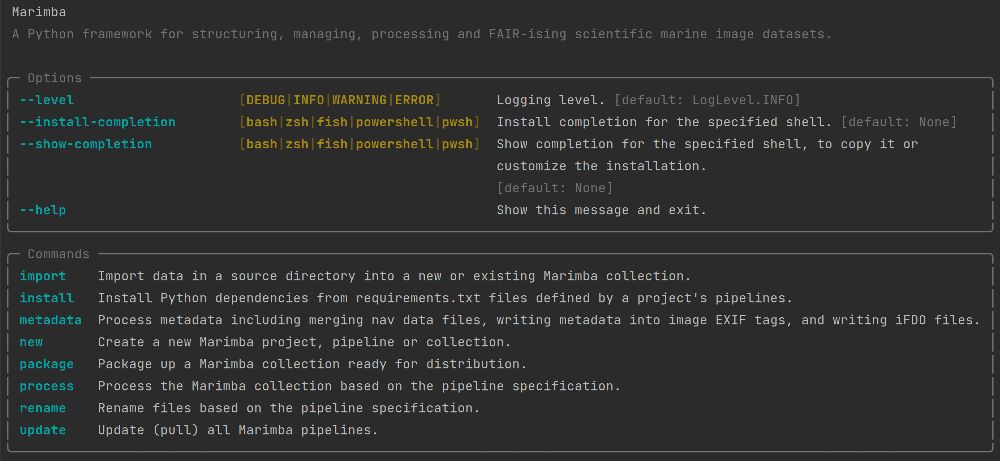

<a name="readme-top"></a>

<!-- PROJECT LOGO -->
<figure markdown style="text-align: center">


</figure>

<div style="text-align: center">

<p><i>A Python framework for structuring, managing, processing and FAIR-ising scientific marine image datasets.</i></p>
<div>
  <a href="https://github.com/elangosundar/awesome-README-templates/stargazers"></a>
<a href="https://github.com/elangosundar/awesome-README-templates/network/members"></a>
<a href="https://github.com/elangosundar/awesome-README-templates/pulls"></a>
<a href="https://github.com/elangosundar/awesome-README-templates/issues"></a>
<a href="https://github.com/elangosundar/awesome-README-templates/graphs/contributors"></a>
<a href="https://github.com/elangosundar/awesome-README-templates/blob/master/LICENSE"></a>
</div>
(all badges show example values, but will show real values when this project is open-sourced)
<br>
</div>

Marimba is a Python framework designed for efficient processing of FAIR (Findable, Accessible, Interoperable, and Reusable) scientific marine image datasets. Developed collaboratively by [CSIRO](https://www.csiro.au/) and [MBARI](https://www.mbari.org/), Marimba offers a core set of functionality aimed to facilitate the structuring, processing and FAIR-ising of marine imaging data. The framework implements a [Typer](https://typer.tiangolo.com/) CLI (Command Line Interface), and makes use of the [Rich](https://pypi.org/project/rich/) Python package to deliver an enhanced CLI user experience. Marimba also provides a well-structured API (Application Programming Interface) that enables programmatic interaction from external scripts or Graphical User Interfaces (GUIs).

Marimba defines three core concepts:

- **Project**: A Marimba Project is a standardised high-level structure designed to manage the complete processing workflow when producing FAIR marine image datasets. It functions as the primary context for importing, processing, packaging and distributing FAIR image datasets, and is entirely managed by the core Marimba system.


- **Pipeline**: A Marimba Pipeline contains the implementation for all image data processing stages from individual or ensembles of instruments. The execution of a Pipeline is managed by core Marimba, and each Marimba Pipelines operates in isolation, which requires that it contains all the necessary logic to completely process the image data. This can include multiple image or video sources, associated navigational data and any other ancillary information. Developing a custom Marimba Pipeline is the only requirement for processing new FAIR marine image datasets using Marimba.


- **Collection**: A Marimba Collection is a set of data that is imported into a Marimba project in a single session. It can be a diverse aggregation of data from a single instrument or multi-instrument system, and is isolated within the context of Marimba's core processing mechanisms. During execution, Marimba Pipelines operate sequentially on each Collection, applying the Pipeline's specialised processing to the sandboxed image data contained within each Collection.


The Marimba framework offers a number of advanced features designed for various aspects of scientific marine imaging:

- **Project Structuring and Management:**
  - Marimba facilitates a systematic approach to structuring and managing scientific image data projects through the entire image processing workflow.
  - The core Marimba features are designed to manage the processing of isolated Pipelines on sandboxed Collections, which allows for the entire processing workflow to be automated.
  - Marimba provides a unified interface...
- **File and Metadata Management:**
  - Custom Marimba Pipelines allow for the implementation of specific naming conventions to automatically rename image files.
  - Marimba offers extensive capabilities for managing image metadata including:
    - Compliance with [iFDO](https://marine-imaging.com/fair/ifdos/iFDO-overview/) (image FAIR Digital Object) standards to ensure interoperability and reusability.
    - Integration of image datasets with corresponding navigation and sensor data, if available.
    - Writing metadata directly into image EXIF tags for greater accessibility.
- **Image and Video Processing: (to be implemented)**
  - Marimba offers a standard library of image and video processing modules that can:
    - Convert, compress and resize imagery using the Python [Pillow](https://pypi.org/project/Pillow/) library.
    - Transcode, chunk and extract frames from videos using [Ffmpeg](https://ffmpeg.org/).
    - Automatically generate thumbnails for images and videos and create composite overview thumbnail images for rapid contents assessment of image datasets.
    - Detect duplicate, blurry, or improperly exposed images using [CleanVision](https://github.com/cleanlab/cleanvision) library.
- **Dataset Packaging and Distribution:**
  - Marimba provides a standardised method for packaging processed FAIR image datasets, including:
    - Collation of all processing logs to archive the entire dataset provenance and provide transparency and traceability.
    - Generation of file manifests for dataset validation.
    - Automated summarisation of image dataset statistics.
  - Marimba also provides mechanisms for distributing packaged FAIR image datasets including:
    - Uploading FAIR image datasets to S3 buckets.


---

## Contents

- [Installation](#installation)
- [Usage](#usage)
- [Design](#design)
- [Contributing](#contributing)
- [License](#license)
- [Contact](#contact)
- [Acknowledgments](#acknowledgments)

---

<a name="installation"></a>
### Installation

The Marimba framework can be installed using Python pip package manager. Ensure you have a compatible version of Python installed (3.10 or greater) on your system before proceeding.

To install Marimba, open your terminal or command prompt and run the following command:

```bash
pip install marimba
```

This will download and install the latest version of Marimba along with any required dependencies. After successful installation, you can run Marimba to see the default help menu and confirm has been correctly installed:

```bash
marimba
```



Marimba has minimal system level dependencies, such as `ffmpeg`, that are required to make full use of the Marimba standard library. On Ubuntu you can install `ffmpeg` with:

```bash
sudo apt install ffmpeg
```

To set up a Marimba development environment, additional instructions and guidelines can be found in the documentation located in the [ENVIRONMENT.md](docs/ENVIRONMENT.md). Please refer to the relevant section for detailed information on how to properly configure your development setup.


<p align="right">(<a href="#readme-top">back to top</a>)</p>

---

<a name="usage"></a>
## Usage

* Quick CLI demo of the necessary command needed to process a Marimba Pipeline
* More detailed version at [CLI.md](docs/CLI.md)


<p align="right">(<a href="#readme-top">back to top</a>)</p>

---

<a name="design"></a>
## Design

* Overview paragraph about how core Marimba interacts with Pipelines
* Note that a Marimba Pipeline is the only thing needed to be implemented to process FAIR image datasets in Marimba
  * Link to more detailed documentation on how to implement a Marimba [Pipeline](docs/PIPELINE.md)
* Mention that Marimba also exposes an API
  * Super brief usage of API
  * Link to more detailed documentation on how to use the Marimba [API](docs/API.md)

<p align="right">(<a href="#readme-top">back to top</a>)</p>

---

<a name="contributing"></a>
## Contributing

Marimba is an open-source project and we welcome contributions. If you have a suggestion that would make Marimba better, please clone the repo and submit a pull request by following the [CONTRIBUTING.md](docs/CONTRIBUTING.md) documentation.

<p align="right">(<a href="#readme-top">back to top</a>)</p>

---

<a name="license"></a>
## License

This project is licensed under [MIT](https://opensource.org/licenses/MIT) license. Please refer to the [LICENSE.md](LICENSE.md) file for information regarding the licensing agreement for Marimba.

TODO: This needs to be reviewed according to CSIRO current licensing recommendations.
There was recently an interesting thread on the MS Teams linux channel [here](https://teams.microsoft.com/l/message/19:f76b576ac1df4742a7a8cb5c2a86439d@thread.skype/1673393871094?tenantId=0fe05593-19ac-4f98-adbf-0375fce7f160&groupId=20e7492d-eca3-4f55-bbc6-e87f2ad12df2&parentMessageId=1673393871094&teamName=CSIRO&channelName=linux&createdTime=1673393871094&allowXTenantAccess=false)

<p align="right">(<a href="#readme-top">back to top</a>)</p>

---

<a name="contact"></a>
## Contact

The primary contacts for this repository are: 
* Chris Jackett - CSIRO
* Kevin Barnard - MBARI

<p align="right">(<a href="#readme-top">back to top</a>)</p>

---

<a name="acknowledgments"></a>
## Acknowledgments

This project has been developed as a collaboration between CSIRO and MBARI, two leading institutions in marine science and technology. The conceptual foundation of Marimba was formulated at CSIRO in late 2022. Substantial elements of its initial design and implementation were created during the CSIRO Image Data Collection and Delivery Hackathon in Feb/March 2023, along with further collaborative development between CSIRO and MBARI in Oct/Nov 2023.

The development of this project has benefited from the contributions of many people including:

* Chris Jackett - CSIRO Environment
* Kevin Barnard - MBARI
* Nick Mortimer - CSIRO Environment
* David Webb - CSIRO NCMI
* Aaron Tyndall - CSIRO NCMI
* Franzis Althaus - CSIRO Environment
* Candice Untiedt - CSIRO Environment
* Carlie Devine - CSIRO Environment
* Bec Gorton - CSIRO Environment
* Ben Scoulding - CSIRO Environment

<p align="right">(<a href="#readme-top">back to top</a>)</p>

