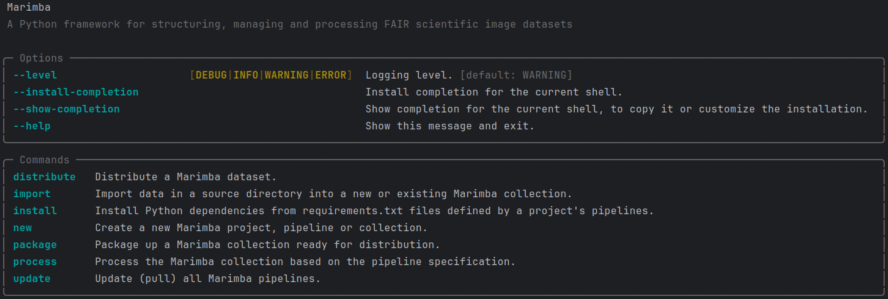

<a name="readme-top"></a>

<!-- PROJECT LOGO -->
<figure markdown style="text-align: center">


</figure>

<div style="text-align: center">
<p><i>A Python framework for structuring, managing and processing FAIR scientific image datasets</i></p>
<div>
  <a href="https://github.com/csiro-fair/marimba/stargazers">
    
  </a>
  <a href="https://github.com/csiro-fair/marimba/network/members">
    
  </a>
  <a href="https://github.com/csiro-fair/marimba/pulls">
    
  </a>
  <a href="https://github.com/csiro-fair/marimba/issues">
    
  </a>
  <a href="https://github.com/csiro-fair/marimba/graphs/contributors">
    
  </a>
  <a href="https://github.com/csiro-fair/marimba/blob/master/LICENSE">
    
  </a>
</div>
<br>
</div>

---

## Contents

- [Overview](#overview)
- [Design](#design)
- [Features](#features)
- [Installation](#installation)
- [Getting Started](#getting-started)
- [Documentation](#documentation)
- [Contributing](#contributing)
- [License](#license)
- [Contact](#contact)
- [Acknowledgments](#acknowledgments)

---

<a name="overview"></a>
## Overview

Marimba is a Python framework designed for the efficient processing of
[FAIR (Findable, Accessible, Interoperable, and Reusable)](https://ardc.edu.au/resource/fair-data/) scientific image
datasets. Developed collaboratively by [CSIRO](https://www.csiro.au/) and [MBARI](https://www.mbari.org/), Marimba 
provides core functionality for structuring, processing, and ensuring the FAIR compliance of scientific image data.

The framework features a [Typer](https://typer.tiangolo.com/) Command Line Interface (CLI) enhanced by 
[Rich](https://pypi.org/project/rich/) for an improved user experience. Marimba offers a well-defined API (Application
Programming Interface) that enables seamless integration with external scripts and Graphical User Interfaces (GUIs).

Marimba is particularly well-suited for researchers, data scientists, and engineers working in marine science and other 
fields that require large-scale and streamlined image dataset management. Typical use cases include automating the 
processing of imagery from underwater vehicles, integrating multi-instrument data for comprehensive analysis, and 
preparing datasets for publication in FAIR-compliant repositories.

<p align="right">(<a href="#readme-top">back to top</a>)</p>

---

<a name="design"></a>
## Design

Marimba defines three core concepts:

- **Project**: A Marimba Project is a standardised, high-level structure designed to manage the entire processing 
workflow for producing FAIR image datasets. It serves as the primary context for importing, processing, packaging and 
distributing these datasets, with all high-level operations managed by the core Marimba system.


- **Pipelines**: A Marimba Pipeline encapsulates the implementation of all processing stages for a single or 
multi-instrument system. Each Pipeline operates in isolation, containing all necessary logic to fully process image 
data, which may include multiple image or video sources, associated navigational data, and other ancillary 
information. The core Marimba system manages Pipeline execution, and developing a custom Pipeline is the only 
requirement for processing FAIR image datasets for new instruments or systems with Marimba.


- **Collections**: A Marimba Collection is a set of data that is imported into a Marimba project and can include a 
diverse aggregation of data from a single or multi-instrument system. Each Collection is isolated within the context of 
Marimba's core processing environment. During execution, Marimba Pipelines operate on each Collection in parallel, 
applying the specialised processing to the data contained within each Collection.

<p align="right">(<a href="#readme-top">back to top</a>)</p>

---

<a name="features"></a>
## Features

The Marimba framework offers a number of advanced features designed for the specific needs of scientific image 
processing:

- **Project Structuring and Management:**
  - Marimba enables a systematic approach to structuring and managing scientific image data projects throughout the 
  entire processing workflow
  - Core features of Marimba manage the parallelised execution of isolated Pipelines on sandboxed Collections, enabling 
  full automation of the processing workflow
  - Marimba supports the use of hard links during processing to prevent data duplication and optimise storage efficiency
  - Marimba provides a unified interface for importing, processing, packaging, and distributing datasets, ensuring 
  consistency and efficiency across all stages


- **File and Metadata Management:**
  - Custom Marimba Pipelines support the implementation of specific naming conventions to automatically rename image 
  files 
  - Marimba supports user prompting to manually input Pipeline and Collection-level metadata 
  - Metadata configuration dictionaries can be optionally passed via the CLI to automate manual input stages
  - Marimba provides extensive capabilities for managing image metadata, including:
    - Ensuring compliance with the [iFDO](https://marine-imaging.com/fair/ifdos/iFDO-overview/) (image FAIR Digital 
    Object) standard to ensure interoperability and reusability
    - Integrating image datasets with corresponding navigation and sensor data, when available
    - Embedding metadata directly into image EXIF tags for greater accessibility


- **Standard Image and Video Library:**
  - Marimba provides a comprehensive standard library of image and video processing modules that can:
    - Convert, compress and resize imagery using [Pillow](https://pypi.org/project/Pillow/)
    - Transcode, segment and extract frames from videos using [Ffmpeg](https://ffmpeg.org/) (to be integrated)
    - Automatically generate thumbnails for images and videos and create composite overview images for rapid assessment 
    of image datasets
    - Detect duplicate, blurry, or improperly exposed images using 
    [CleanVision](https://github.com/cleanlab/cleanvision) (to be integrated)


- **Dataset Packaging and Distribution:**
  - Marimba offers a standardised approach for packaging processed FAIR image datasets, including:
    - Collating all processing logs to archive the entire dataset provenance, ensuring transparency and traceability
    - Generating file manifests to facilitate dataset validation
    - Dynamically generating summaries of image and video dataset statistics
  - Marimba also provides mechanisms for distributing packaged FAIR image datasets including:
    - Uploading FAIR image datasets to S3 buckets

<p align="right">(<a href="#readme-top">back to top</a>)</p>

---

<a name="installation"></a>
## Installation

Marimba can be installed using the Python pip package manager. Ensure that Python version 3.10 or greater is installed 
in your environment before proceeding.

To install Marimba, open your terminal or command prompt and run the following command:

```bash
pip install marimba
```

This will download and install the latest version of Marimba along with its required dependencies. After installation, 
you can verify the installation by running Marimba and displaying the default help menu:

```bash
marimba
```



Marimba has minimal system level dependencies, such as `ffmpeg`, which are required for its operation. On Ubuntu you can 
install `ffmpeg` with:

```bash
sudo apt install ffmpeg
```

To set up a Marimba development environment, please refer to the [Environment Setup Guide](docs/environment.md), which 
provides detailed instructions and guidelines for configuring your development environment.

<p align="right">(<a href="#readme-top">back to top</a>)</p>

---

<a name="getting-started"></a>
## Getting Started

Marimba offers a streamlined CLI that encompasses the entire post-acquisition data processing workflow. Below is a 
minimal demonstration of the key CLI commands required to progress through all the Marimba processing stages.

1. **Create a new Marimba Project:**

   ```bash
   marimba new project MY-PROJECT
   cd MY-PROJECT
   ```

2. **Create a new Marimba Pipeline:**

   ```bash
   marimba new pipeline MY-INSTRUMENT https://path.to/my-instrument-pipeline.git
   ```

3. **Import new Marimba Collections:**

   ```bash
   marimba import COLLECTION-ONE '/path/to/collection/one/'
   marimba import COLLECTION-TWO '/path/to/collection/two/'
   ```

4. **Process the imported Collections with the installed Pipelines:**

   ```bash
   marimba process
   ```

5. **Package the FAIR image dataset:**

   ```bash
   marimba package MY-FAIR-DATASET --version 1.0 --contact-name "Keiko Abe" --contact-email "keiko.abe@email.com"
   ```

For additional details and advanced usage, please refer to the [Overview and CLI Usage Guide](docs/overview.md).

*Note: [Keiko Abe](https://en.wikipedia.org/wiki/Keiko_Abe) is a renowned Japanese marimba player and composer, widely 
recognised for her role in establishing the marimba as a respected concert instrument.*

<p align="right">(<a href="#readme-top">back to top</a>)</p>

---

<a name="documentation"></a>

## Documentation

Marimba offers extensive documentation to support both users and developers:

### Users

If you're interested in creating your own Pipelines to process image data, Marimba provides a comprehensive guide to 
help you get started. This documentation covers everything from setting up a Pipeline git repository to implementing 
custom processing pipelines.

- **[Overview and CLI Usage Guide](docs/overview.md)**: Gain an architectural understanding of Marimba and explore the 
various CLI commands and options available to enhance pipeline management and execution, detailed in the comprehensive 
CLI usage guide.


- **[Pipeline Implementation Guide](docs/pipeline.md)**: This guide offers a step-by-step tutorial on how to design and 
tailor Marimba Pipelines to suit your unique data processing requirements. From initial setup to advanced 
customization techniques, learn everything you need to efficiently use Marimba for your specific projects.


### Developers

For developers who want to script Marimba using the CLI or leverage the Marimba API for more advanced integrations, we 
offer detailed documentation that covers all aspects of Marimba’s capabilities.

- **[CLI Scripting Guide](docs/cli.md)**: Learn how to automate data processing workflows using Marimba's CLI. This 
guide provides detailed instructions and examples to help you streamline your data processing operations.


- **[API Reference](docs/api.md)**: Explore the Marimba API to integrate its functionalities into your applications or 
workflows. The reference includes detailed descriptions of Python API endpoints and their usage.

These resources are designed to help you make the most of Marimba, whether you are processing large datasets or 
integrating Marimba into your existing systems.

<p align="right">(<a href="#readme-top">back to top</a>)</p>

---

<a name="contributing"></a>
## Contributing

Marimba is an open-source project, and we welcome feedback and contributions from the community. If you have ideas or 
suggestions to improve Marimba, we encourage you to submit them using our 
[GitHub issue tracker](https://github.com/csiro-fair/marimba/issues). For enhancements or new features, we encourage you 
to fork the repository and submit a pull request. Please refer to the [Contributing Guide](docs/contributing.md) for 
detailed guidelines on how to contribute.

<p align="right">(<a href="#readme-top">back to top</a>)</p>

---

<a name="license"></a>
## License

This project is distributed under the [CSIRO BSD/MIT](LICENSE) license.

<p align="right">(<a href="#readme-top">back to top</a>)</p>

---

<a name="contact"></a>
## Contact

For inquiries related to this repository, please contact:

- **Chris Jackett**  
  *Software Engineer, CSIRO*  
  Email: [chris.jackett@csiro.au](mailto:chris.jackett@csiro.au)


- **Kevin Barnard**  
  *Software Engineer, MBARI*  
  Email: [kbarnard@mbari.org](mailto:kbarnard@mbari.org)

<p align="right">(<a href="#readme-top">back to top</a>)</p>

---

<a name="acknowledgments"></a>
## Acknowledgments

Marimba was developed as a collaborative effort between CSIRO and MBARI, two leading institutions in marine science 
and technology. The conceptual foundation of Marimba was formulated at CSIRO in late 2022. Substantial elements of 
its initial design and implementation were developed during the CSIRO Image Data Collection and Delivery Hackathon 
in early 2023, with further collaborative advancements between CSIRO and MBARI in late 2023. Marimba was 
open-sourced on [GitHub](https://github.com/csiro-fair/marimba) and [PyPI](https://pypi.org/project/marimba) in 
mid-2024 and officially launched at the [Marine Imaging Workshop 2024](https://miw2024.org/).

The development of this project has greatly benefited from the contributions of the following people:

* Chris Jackett - CSIRO Environment
* Kevin Barnard - MBARI
* Nick Mortimer - CSIRO Environment
* David Webb - CSIRO NCMI
* Aaron Tyndall - CSIRO NCMI
* Franzis Althaus - CSIRO Environment
* Candice Untiedt - CSIRO Environment
* Carlie Devine - CSIRO Environment
* Bec Gorton - CSIRO Environment
* Ben Scoulding - CSIRO Environment

<p align="right">(<a href="#readme-top">back to top</a>)</p>

---
