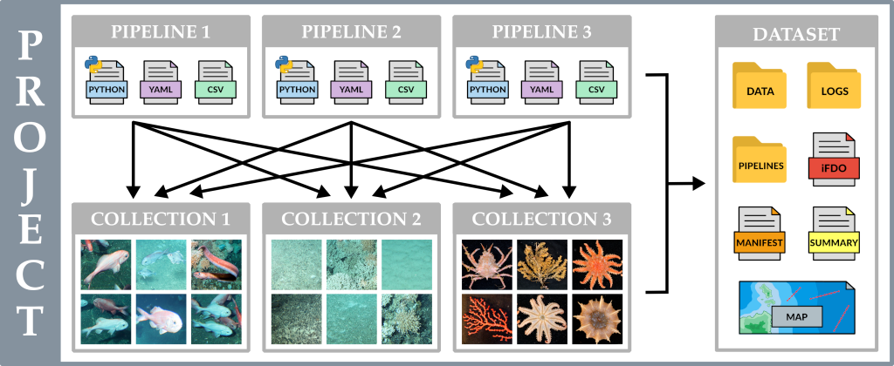

# Pipeline Implementation Guide

A Marimba Pipeline is the core component responsible for processing data from a specific instruments or 
multi-instrument systems. Pipelines contain the complete logic required to transform raw data into FAIR-compliant 
datasets, allowing you to automate complex workflows tailored to the unique requirements of your data. By developing 
a custom Pipeline, you can take advantage of Marimba's powerful features while integrating your own specialised 
processing steps. This guide will walk you through everything you need to know to create and implement your own Marimba 
Pipeline, from setting up the structure of your Pipeline and implementing key methods, to making use of the available 
processing capabilities the Marimba standard library.

---

## Table of Contents

1. [Introduction to Pipelines](#introduction-to-pipelines)
2. [Understanding Marimba Pipelines](#understanding-marimba-pipelines)
   - [What Is a Marimba Pipeline?](#what-is-a-marimba-pipeline)
   - [Pipeline Components](#pipeline-components)
3. [Setting Up a New Pipeline](#setting-up-a-new-pipeline)
   - [Initializing the Pipeline](#initializing-the-pipeline)
   - [Managing Dependencies](#managing-dependencies)
4. [Implementing Your Pipeline](#implementing-your-pipeline)
   - [Implementing the `get_pipeline_config_schema` Method](#implementing-the-get_pipeline_config_schema-method)
        - [Example `get_pipeline_config_schema` Implementation](#example-get_pipeline_config_schema-implementation)
   - [Implementing the `get_collection_config_schema` Method](#implementing-the-get_collection_config_schema-method)
        - [Example `get_collection_config_schema` Implementation](#example-get_collection_config_schema-implementation)
   - [Implementing the `_import` Method](#implementing-the-_import-method)
        - [Example `_import` Implementation](#example-_import-implementation)
        - [Dry Run Mode](#dry-run-mode)
        - [Marimba Logging](#marimba-logging)
        - [Utilizing the `operation` Option](#utilizing-the-operation-option)
        - [Executing the `_import` Method](#executing-the-_import-method)
        - [Metadata Handling in Marimba Pipelines](#metadata-handling-in-marimba-pipelines)
           - [Pipeline-level Metadata](#pipeline-level-metadata)
           - [Collection-level Metadata](#collection-level-metadata)
           - [Metadata Handling Summary](#metadata-handling-summary)
       - [Defining and Using Custom `kwargs`](#defining-and-using-custom-kwargs)
            - [How to Pass Custom `kwargs` Through the CLI](#how-to-pass-custom-kwargs-through-the-cli)
            - [Accessing `kwargs` in a Marimba Pipeline](#accessing-kwargs-in-a-marimba-pipeline)
   - [Implementing the `_process` Method](#implementing-the-_process-method)
        - [Example `_process` Implementation](#example-_process-implementation)
        - [Executing the `_process` Method](#executing-the-_process-method)
          - [Targeted Processing with Specific Pipelines and Collections](#targeted-processing-with-specific-pipelines-and-collections)
        - [Multithreaded Thumbnail Generation](#multithreaded-thumbnail-generation)
   - [Implementing the `_package` Method](#implementing-the-_package-method)
        - [Example `_package` Implementation](#example-_package-implementation)
        - [Executing the `_package` Method](#executing-the-_package-method)
          - [Targeted Packaging with Specific Pipelines and Collections](#targeted-packaging-with-specific-pipelines-and-collections)
        - [Marimba Packaging Steps](#marimba-packaging-steps)
        - [Multi-Level iFDO Files](#multi-level-ifdo-files)
        - [Multi-Level Summary Files](#multi-level-summary-files)
5. [Pipeline Implementation Summary](#pipeline-implementation-summary)
   - [Next Steps](#next-steps)

---

## Introduction to Pipelines

Marimba is designed with a clear distinction between the core Marimba system and user-authored Pipelines that are
responsible for processing data from single or multi-instrument systems. This modular architecture allows you to 
create custom Pipelines designed to your specific data processing requirements, while minimizing the amount of 
boilerplate code required to achieve an operational processing system.

Within a Marimba Project, the core Marimba system manages the overall workflow, including the execution of key 
Pipeline methods (`_import`, `_process` and `_package`), the capture of processing logs, and the final packaging of 
datasets. The Pipeline itself is only responsible for implementing the necessary logic and code specific to the 
instruments or systems it is designed to process.

---

## Understanding Marimba Pipelines

### What Is a Marimba Pipeline?

A Marimba Pipeline is a Python file that defines the processing logic for data from a specific instrument or 
multi-instrument system. It is executed from within the context of a Marimba Project and interacts with the core 
Marimba system to perform tasks such as importing data, processing them, and preparing them for final 
datasets packaging.

Marimba Pipelines inherit from the Marimba `BasePipeline` class and must implement the specific methods that define 
their behavior. This design provides several key advantages:

- **Modularity**: Pipelines can be developed, tested, and maintained independently
- **Reusability**: Pipelines can be shared and reused across different projects
- **Customization**: Each Pipeline can be customised to handle the unique requirements of different instruments and 
data sources


### Pipeline Components

Understanding the structure and components of a Marimba Pipeline is essential for successful implementation. All custom 
Pipelines must inherit from the
[BasePipeline](https://github.com/csiro-fair/marimba/blob/docs/user-and-developer-docs/marimba/core/pipeline.py)
class provided by Marimba. The `BasePipeline` class defines the interface that your Pipeline must implement, 
including:

- `get_pipeline_config_schema()`: 
  - This method returns a dictionary schema that users will be prompted to complete when adding a new Marimba 
    Pipeline to a Marimba Project.
  - In this schema, you define the Pipeline-level metadata to be captured, such as `voyage_id`, `voyage_pi`, 
    `platform_id`, `start_date`, `end_date`, etc.
  - The result of this captured metadata are stored in a `pipeline.yml` file located in the Pipeline’s root directory. 
    This metadata is then made available by Marimba throughout all stages of Pipeline processing.


- `get_collection_config_schema()`:
  - This method returns a dictionary schema that users will be prompted to complete when adding a new Marimba 
    Collection to a Marimba Project.
  - In this schema, you define the Collection-level metadata to be captured, such as `deployment_id`, `site_id`, 
    `batch_id`, `data_collector`, etc. 
  - The result of this captured metadata are stored in a `collection.yml` file located in the Collection’s root 
    directory. This metadata is then made available by Marimba throughout all stages of Pipeline processing.


- `_import()`:
  - This method manages the importation of raw data into a designated Marimba Collection. It is designed to be 
    implemented for a single import source, such as a folder on a hard disk or a mounted external storage device. 
    Core Marimba orchestrates the execution of this method for each installed Pipeline and every specified import 
    source within the Collection.
  - The primary function of this method is to ensure that all raw data files are correctly transferred into the 
    designated Collection directory, ready for subsequent processing stages. During this step, there is also the 
    potential to implement hierarchical directory structuring and renaming of files to enhance data organization.
  - This import process is useful for maintaining the integrity and organization of data within a Marimba Project, 
    enabling effective and efficient data management across the entire Pipeline workflow.

    
- `_process()`:
  - This method contains the core processing logic of the Pipeline. It is responsible for applying specific 
    transformations, analyses, and enhancements to the imported data within Marimba Collections.
  - The `_process` method should be designed to handle the unique requirements and characteristics of the data, and 
    can include processing steps such as converting image file formats, transcoding video files, generating image 
    thumbnails, merging sensor data, etc. 
  - Once the `_process` method has been executed, the data should be ready for the final packaging stage.


- `_package()`:
  - This method prepares the processed data for packaging, organizing the final assembly of the dataset. It is 
    designed to be implemented for a single Collection, with core Marimba orchestrating the packaging of each 
    Pipeline against every Collection, unless selected Pipelines and Collections are specified.
  - The `_package` method is responsible for returning a data mapping that specifies all the files to be included in 
    the final dataset. This process typically involves recursively scanning all files within a Collection to 
    assemble the necessary data mapping.
  - For each image and/or video file, the data mapping can include an
    [ImageData](https://github.com/kevinsbarnard/ifdo-py/blob/main/ifdo/models.py#L177) object, which is a Python 
    implementation of the [iFDO](https://marine-imaging.com/fair/ifdos/iFDO-overview/) specification.
  - Files listed in the data mapping that contain an iFDO will have their metadata saved in a dataset-level iFDO 
    output file named `ifdo.yml`. Additionally, this metadata will be embedded in the EXIF metadata of any included 
    JPEG file, adhering to FAIR data standards.

---

## Setting Up a New Pipeline

Marimba Pipelines have been designed to be set up in their own git repositories. This approach offers the benefits 
of version control and modularity, allowing for better management and tracking of changes. We recommend setting up 
a free GitHub account and creating a repository there to host your new Marimba Pipeline.

The simplest structure for a Marimba Pipeline is as follows:

```plaintext
my-pipeline
├── requirements.txt     # Additional Pipeline-level dependencies required by the Pipeline
└── my.pipeline.py       # The Marimba Pipeline implementation
```

Pipeline authors have full control over their repository's structure, which means you can include additional 
directories and files as necessary. For example:

```plaintext
my-pipeline
├── data                            # Optional directory containing Pipeline ancillary data
│   ├── platform_data.csv           # Example additional CSV data file
│   ├── calibration_files.txt       # Example additional instrument calibration file
│   └── camera_serial_numbers.yml   # Example additional camera details file
├── .gitignore                      # Files and directories to be ignored by Git version control
├── requirements.txt                # Additional Pipeline-level dependencies required by the Pipeline
└── my_pipeline.py                  # The Marimba Pipeline implementation
```

It's important to note that Marimba Pipelines have the extension `.pipeline.py`. Marimba is configured to automatically 
identify and bootstrap files with this extension located within the Marimba Project's pipelines directory. Therefore, 
all Marimba Pipelines must utilize this extension for proper recognition and operation.

To initialize a new Marimba Pipeline, you must first create a new Marimba Project:

```bash
marimba new project my-project
cd my-project
```

There are a couple of methods to create a new Marimba Pipeline:

1. **Create an empty Git repository and integrate it into your Marimba Project:**

   - **Set up a GitHub account:**
     - Visit [GitHub](https://github.com/signup) and sign up for a new account or log in if you already have one
     - Once logged in, click on "New repository" or navigate to [create a new repository](https://github.com/new)

   - **Create a new repository:**
     - Name your repository (e.g., `my-pipeline`)
     - Choose whether to make the repository public or private
     - Click "Create repository"

   - **Copy the repository URL:**
     - Once your repository is created, GitHub will display the repository page. Copy the URL provided under 
     "Quick setup" — it will look something like `https://github.com/your-user-name/my-pipeline.git`

   - **Clone the new empty repository into your Marimba Project:**
     ```bash
     marimba new pipeline my-pipeline https://github.com/your-user-name/my-pipeline.git
     ```
     This command will clone the Git repository into a new directory in the Marimba project at `pipelines/my-pipeline`.

2. **Manually create the Marimba Pipeline directory and connect it to your Git repository:**
    - Create the pipeline directory:
       ```bash
       mkdir -p pipelines/my-pipeline
       ```
    - Navigate into your new Pipeline directory:
       ```bash
       cd pipelines/my-pipeline
       ```
    - Initialize a new Git repository:
       ```bash
       git init
       ```
    - Link your local repository to GitHub:
       ```bash
       git remote add origin https://github.com/your-user-name/my-pipeline.git
       ```
       This step connects your local Pipeline implementation to your GitHub repository, allowing you to use standard 
       Git commands to add, commit, and push files
    - Now, navigate back to the root Marimba Project directory:
       ```bash
       cd ../..
       ```

For both of these setup methods, the next steps involve initializing the necessary Pipeline files in your new Pipeline 
directory.


### Initializing the Pipeline

- Create the Marimba Pipeline file:
  ```bash
  touch pipelines/my-pipeline/my.pipeline.py
  ```
- Stage and commit the changes:
  ```bash
  git add .
  git commit -m "Initial commit of Marimba Pipeline"
  ```

Start coding your Pipeline by opening your new `my.pipeline.py` file in a text editor or IDE. Below is a basic 
template to help you get started with your Marimba Pipeline implementation:

```python
from pathlib import Path
from typing import Any, Dict, List, Optional, Tuple

from ifdo.models import ImageData

from marimba.core.pipeline import BasePipeline


class MyPipeline(BasePipeline):

    @staticmethod
    def get_pipeline_config_schema() -> dict:
        return {}

    @staticmethod
    def get_collection_config_schema() -> dict:
        return {}

    def _import(
        self,
        data_dir: Path,
        source_path: Path,
        config: Dict[str, Any],
        **kwargs: dict,
    ):

        return

    def _process(
        self,
        data_dir: Path,
        config: Dict[str, Any],
        **kwargs: dict,
    ):

        return

    def _package(
        self,
        data_dir: Path,
        config: Dict[str, Any],
        **kwargs: dict,
    ) -> Dict[Path, Tuple[Path, Optional[List[ImageData]], Optional[Dict[str, Any]]]]:

        data_mapping: Dict[Path, Tuple[Path, Optional[List[ImageData]], Optional[Dict[str, Any]]]] = {}
        return data_mapping
```

This basic code template sets up the structure for your Marimba Pipeline, including methods to handle importing, 
processing, and packaging of data.


### Managing Dependencies

To make sure your environment includes all the necessary Python packages specific to your Pipeline, you can specify 
them in a `requirements.txt` file located within the root directory of your Pipeline repo:

```bash
touch pipelines/my-pipeline/requirements.txt
```

Here's an example of what the contents of your `requirements.txt` might look like:

```plaintext
# pipelines/my-pipeline/requirements.txt
scipy
matplotlib
scikit-image
```

After creating or updating your `requirements.txt`, make sure to stage and commit these changes with Git:

```bash
git add pipelines/my-pipeline/requirements.txt
git commit -m "Adding Marimba Pipeline-specific requirements.txt"
```

Marimba streamlines the installation of these Pipeline-specific packages with the following command:

```bash
marimba install
```

This command automatically traverses all installed Pipelines and installs all the packages listed in their 
`requirements.txt` files, ensuring that each Pipeline has the necessary environment to run successfully.

---

## Implementing Your Pipeline

Implementing your Marimba Pipeline involves writing the necessary code to import, process, and package your data. In 
total, five key methods need to be implemented within your Pipeline. Two of these methods are focused on capturing 
metadata at the Pipeline and Collection levels, while the other three implement the specific data processing and 
reporting procedures for your instrument or system.


### Implementing the `get_pipeline_config_schema` Method

The `get_pipeline_config_schema()` method is designed to define the schema for capturing Pipeline-level metadata. 
This metadata typically includes details that are constant across various collections within the same Marimba Project, 
such as project principal investigator or platform ID. Here’s an example of a simple implementation of this method:


#### Example `get_pipeline_config_schema` Implementation

```python
@staticmethod
def get_pipeline_config_schema() -> dict:
    return {
        "project_pi": "Keiko Abe",
        "platform_id": "YM-6100",
    }
```

Here’s another example implementation of the method, demonstrating how to define detailed metadata for a voyage-based
oceanographic research project:

```python
@staticmethod
def get_pipeline_config_schema() -> dict:
    return {
        "voyage_pi": "Keiko Abe",
        "voyage_id": "RSAM202105",
        "start_date": "2021-05-01",
        "end_date": "2021-05-01",
        "data_collector": "Minoru Miki",
        "platform_id": "YM-6100",
    }
```

When a user creates a new Marimba Pipeline, they will be prompted to enter values for each element defined in this 
schema. Each value in the key-value pairs of the dictionary act as a default option provided to the user, who can 
simply press enter to accept the default value or input a new one as necessary. The completion of this process 
results in the creation of a new pipeline metadata file located at `pipelines/my-pipeline/pipeline.yml`, which will 
store all the entered Pipeline metadata. This procedure ensures that all necessary metadata is collected efficiently 
and consistently, customized specifically to the needs of the Pipeline and its data management objectives.


### Implementing the `get_collection_config_schema` Method

The `get_collection_config_schema()` method is designed to define the schema for capturing Collection-level metadata,
which is specific to individual Collections within a Marimba Project. Here’s a basic example of how this method can 
be structured:


#### Example `get_collection_config_schema` Implementation

```python
@staticmethod
def get_collection_config_schema() -> dict:
    return {
        "site_id": "TGSM-TOKYO",
        "sample_date": "2021-05-01",
        "data_collector": "Minoru Miki",
    }
```

Here’s another implementation, capturing example metadata for a voyage-based oceanographic research project:

```python
@staticmethod
def get_collection_config_schema() -> dict:
    return {
        "deployment_id": "RSAM202105_001",
        "rov_operator": "Minoru Miki",
        "platform_id": "YM-6100",
    }
```

Similar to the Pipeline-level config schema, users will be prompted to input values for each element defined in this 
schema when setting up a new Marimba Collection. This allows for the capture of Collection-level metadata and results 
in the creation of a new Collection metadata file located at `collections/my-collection-name/collection.yml`, which 
will store all the entered Collection metadata.


### Implementing the `_import` Method

The `_import` method is responsible for bringing raw data into a Marimba Collection. A common pattern for handling 
imports involves recursively searching through all files in the `source_path` and selectively importing them into 
the Collection based on specified criteria.


#### Example `_import` Implementation

```python
from pathlib import Path
from shutil import copy2
from typing import Any, Dict

def _import(
        self,
        data_dir: Path,
        source_path: Path,
        config: Dict[str, Any],
        **kwargs: dict,
    ) -> None:
    
    self.logger.info(f"Importing data from {source_path} to {data_dir}")
    
    for source_file in source_path.rglob("*"):
        if source_file.is_file() and source_file.suffix.lower() in [".csv", ".jpg", ".mp4"]:
            if not self.dry_run:
                copy2(source_file, data_dir)
            self.logger.debug(f"Copied {source_file.resolve().absolute()} -> {data_dir}")
```

In this example, the method begins by logging the start of the import process, noting both the source and destination 
paths. It uses `rglob("*")` from the `pathlib` library to recursively search for files, subsequently verifying if 
each file matches one of the specified extensions (`.csv`, `.jpg`, `.mp4`). This ensures that only targeted files for 
this Pipeline are imported.


#### Dry Run Mode

If the `--dry-run` boolean CLI option is not set to `True` when running the Marimba import command, the files are 
physically copied to the Collection directory (`data_dir`). During a `dry_run`, the method simulates the import process 
by logging the files that would be copied without actually performing the copy operation. This is useful for testing the 
import logic to ensure it behaves correctly without modifying any data.


#### Marimba Logging

We recommend including comprehensive logging statements within your Marimba Pipelines for all significant operations,
utilizing the Marimba logging system (`self.logger.<debug|info|warning|error|critical>`). Marimba is designed to capture
and manage all logs from this system, ensuring that packaged datasets include a complete provenance record of all 
operations performed on the raw data. This documentation not only aids in debugging but also enhances the transparency
of data processing within the Pipeline.


#### Utilizing the `operation` Option

In the Marimba CLI, the import command includes an `operation` flag that allows you to specify how files should be 
transferred into a Marimba Collection. This option can be set to `[copy|move|link]`. The default setting is `copy`, but 
the `move` option is useful for transferring files from a removable storage device like an SD card directly into a 
Marimba collection, effectively clearing the device in the process. Alternatively, the `link` option enables the 
creation of hard-links (on Linux systems), which can avoid the time and disk space overhead associated with copying 
large data volumes, thus speeding up the import process significantly.

If you wish to incorporate these options into your `_import` method, you'll need to implement logic that handles each 
type of operation. Here's how you might modify your `_import` method to include these functionalities:

```python
from pathlib import Path
from shutil import copy2, move
import os
from typing import Any, Dict

def _import(
        self,
        data_dir: Path,
        source_path: Path,
        config: Dict[str, Any],
        **kwargs: dict,
    ) -> None:
    
    operation = kwargs.get('operation', 'copy')
    self.logger.info(f"Starting import from {source_path} to {data_dir} using {operation} operation.")
    
    for source_file in source_path.rglob("*"):
        if source_file.is_file() and source_file.suffix.lower() in [".csv", ".jpg", ".mp4"]:
            target_file = data_dir / source_file.name
            if not self.dry_run:
                if operation == 'copy':
                    copy2(source_file, target_file)
                    self.logger.debug(f"Copied {source_file} to {target_file}")
                elif operation == 'move':
                    move(source_file, target_file)
                    self.logger.debug(f"Moved {source_file} to {target_file}")
                elif operation == 'link':
                    os.link(source_file, target_file)
                    self.logger.debug(f"Linked {source_file} to {target_file}")
```

This revised version of the `_import` method now includes logic to handle `copy`, `move`, and `link` operations based 
on the `operation` key contained in `kwargs`. Each file handling operation is logged for debugging purposes, ensuring 
that you can track which files were processed and by what method, providing a complete trace of the import activity.


#### Executing the `_import` Method

Now that you have successfully implemented the `_import` method, you can import data into a new Marimba Collection 
using the following command:

```bash
marimba import collection-one /path/to/source/directory --operation link
```

With this command, Marimba will execute your `_import` method on the specified source path and create a new Marimba 
Collection at `collections/collection-one`. The method will create hard-links for any files with `.csv`, `.jpg`, or 
`.mp4` extensions found in the source directory.

Congratulations - you have now successfully imported data into a Marimba Collection using an efficient linking 
operation!


#### Metadata Handling in Marimba Pipelines

In Marimba, the capture of both Pipeline-level and Collection-level metadata offers an important role in the scientific 
data processing workflow. 


##### Pipeline-level Metadata

The `self.config` attribute within any Pipeline method contains metadata elements that are captured during the Pipeline 
installation process, as defined by the `get_pipeline_config_schema()` method. This schema specifies the metadata 
required at the Pipeline level, typically including settings that apply across multiple collections or are essential 
for the overall operation of the Pipeline.

Suppose your `get_pipeline_config_schema()` method defines metadata fields like `voyage_id` and `voyage_pi`. You 
can access these fields within your Pipeline methods as follows:

```python
voyage_id = self.config.get('voyage_id')
voyage_pi = self.config.get('voyage_pi')
self.logger.info(f"Processing data for voyage {voyage_id} under the supervision of {voyage_pi}.")
```

This allows your Pipeline to use these configurations dynamically during data processing, enabling for flexible and 
informed handling of data based on the specific metadata.


##### Collection-level Metadata

The `config` dictionary passed into methods like `_import` contains the Collection-level metadata, which is captured as 
defined by the `get_collection_config_schema()` method. This metadata typically relates to specifics of the data 
collection, such as the collection date, site information, or specific parameters used during data collection.

Let’s assume your `get_collection_config_schema()` method captures `collection_date` and `site_id` as metadata for 
each collection. Here’s how you might access these within your Pipeline methods:

```python
collection_date = config.get('collection_date')
site_id = config.get('site_id')
self.logger.info(f"Importing data collected on {collection_date} from site {site_id}.")
```

This allows for each collection to be processed with its unique context, enhancing the detail and contextual 
significance of the data processing.


##### Metadata Handling Summary

By distinguishing between Pipeline-level and Collection-level metadata, Marimba facilitates diverse data management 
strategies within a unified framework. Accessing these metadata elements within your Pipeline methods ensures that you 
can customize the data handling procedures to meet both general and specific requirements effectively. This ability to 
access both Pipeline-level and Collection-level metadata becomes increasingly important later in the `_package` method, 
where the requirement is to report all the data and metadata to core Marimba for final processing.


#### Defining and Using Custom `kwargs`

Marimba enables users to define their own custom `kwargs` (keyword arguments) which can be passed to any command in the 
Marimba CLI using the `--extra` option. This flexibility allows users to introduce additional parameters or settings 
that are not predefined in the Marimba system, but are essential for specific pipeline operations or conditions.

These custom `kwargs` are especially useful in environments where the Pipeline might require dynamic configuration 
changes that are dependent on external factors or where pipeline execution needs to be fine-tuned without altering 
the underlying codebase.


##### How to Pass Custom `kwargs` Through the CLI

When executing a command in the Marimba CLI, users can append the `--extra` flag followed by a key-value pair. These 
are then accessible within any Marimba Pipeline method, allowing the method to adjust its behavior based on the 
custom inputs.

**Example CLI Usage:**

```bash
marimba import collection-one /path/to/source --extra file_types=.txt,.pdf
```

In this example, the `file_types` are custom arguments passed during the import process and specifies additional file 
types to be included during the import.


##### Accessing `kwargs` in a Marimba Pipeline

Here's an example of how you might modify the `_import` method to utilize these custom `kwargs`, adjusting the behavior 
of the import process based on the passed parameters:

**Example Pipeline Method Implementation:**

```python
from pathlib import Path
from shutil import copy2
from typing import Any, Dict

def _import(
        self,
        data_dir: Path,
        source_path: Path,
        config: Dict[str, Any],
        **kwargs: dict,
    ) -> None:
    
    self.logger.info(f"Importing data from {source_path} to {data_dir}")
    
    # Merge default file types with those provided in kwargs
    default_types = [".csv", ".jpg", ".mp4"]
    extra_types = kwargs.get('file_types', '').split(',')
    file_types = default_types + [ftype for ftype in extra_types if ftype not in default_types]
    
    for source_file in source_path.rglob("*"):
        if source_file.is_file() and source_file.suffix.lower() in file_types:
            if not self.dry_run:
                copy2(source_file, data_dir)
            self.logger.debug(f"Copied {source_file.resolve().absolute()} -> {data_dir}")
```

In this updated `_import` method, the `file_types` are extracted from `kwargs` and merged in with the default file 
types. The method then checks each file to determine if its suffix matches with the types listed in `file_types`. This 
example shows how custom `kwargs` can be used to enhance the flexibility of Pipeline operations, providing customizable, 
dynamic, and context-aware data processing within Marimba.


### Implementing the `_process` Method

The `_process` method is designed to handle any data conversion, manipulation, and processing stages following the 
initial import. A typical process in this method might involve setting up a hierarchical directory structure, sorting 
files into specified subdirectories, applying validation or calibration techniques, and executing file-specific tasks 
such as image format conversion, video transcoding, thumbnail creation, and sensor data integration. It could also 
involve compiling data visualizations or generating derived data products. Following the execution of the `_process` 
method, the data should be prepared and ready for the final packaging stage.


#### Example `_process` Implementation

```python
from pathlib import Path
from typing import Any, Dict

from marimba.lib import image

def process(data_dir: Path, config: Dict[str, Any], **kwargs: dict):
    
    self.logger.info(f"Processing data in {data_dir}")

    # Create directories for different file types
    csv_dir = data_dir / "data"
    jpg_dir = data_dir / "images"
    thumbs_dir = data_dir / "thumbnails"
    mp4_dir = data_dir / "videos"
    
    csv_dir.mkdir(exist_ok=True)
    jpg_dir.mkdir(exist_ok=True)
    thumbs_dir.mkdir(exist_ok=True)
    mp4_dir.mkdir(exist_ok=True)

    # Move files into their respective directories
    for file_path in data_dir.rglob("*"):
        if file_path.is_file():
            if file_path.suffix.lower() == ".csv":
                file_path.rename(csv_dir / file_path.name)
            elif file_path.suffix.lower() == ".jpg":
                file_path.rename(jpg_dir / file_path.name)
            elif file_path.suffix.lower() == ".mp4":
                file_path.rename(mp4_dir / file_path.name)

    # Generate thumbnails for each jpg
    thumbnails = []
    for jpg_file in jpg_dir.glob("*.jpg"):
        thumbnail_path = thumbs_dir / f"{jpg_file.stem}_thumbnail{jpg_file.suffix}"
        image.resize_fit(jpg_file, 300, 300, thumbnail_path)
        thumbnails.append(thumbnail_path)

    # Create an tiled overview image from the thumbnails
    overview_path = data_dir / "overview.jpg"
    image.create_grid_image(thumbnails, overview_path)
```

This example organizes and processes various file types previously imported into a Marimba Collection. It begins by 
creating subdirectories for CSV files (`data`), JPG images (`images`), and thumbnails (`thumbnails`), MP4 videos 
(`videos`). It then recursively scans the Collection, moving CSV, JPG, and MP4 files into their respective 
subdirectories. For each JPG file, the method generates a low-resolution thumbnail, saving it in the `thumbnails` 
directory. Finally, it compiles all the generated thumbnails into a single tiled overview image stored in the root 
directory of the Collection using the `create_grid_image` from the Marimba standard library.


#### Executing the `_process` Method

To execute the `_process` method within your Marimba Pipeline, use the Marimba CLI to initiate the process command for 
all Collections across all Pipelines within a Project:

```bash
marimba process
```

Marimba will automatically identify each Pipeline and Collection within the Project and initiate the `_process` method
for each combination. Leveraging its parallelized core architecture, Marimba processes each Pipeline and Collection 
combination independently and concurrently. This approach maximizes the utilization of computing resources and 
significantly accelerates data processing. The image below illustrates how Marimba implements parallel processing, 
showing the interactions between Pipelines and Collections:




##### Targeted Processing with Specific Pipelines and Collections

For more targeted processing, Marimba allows you to specify particular Pipelines and/or Collections. This feature is 
particularly useful when you need to process only a subset of data or test changes in a specific Pipeline without 
affecting the entire dataset. Using the `--collection-name` and `--pipeline-name` CLI options, you can configure 
Marimba to process only the specified subsets of Pipelines and/or Collections. For instance, if you wanted to process 
data only from a specific Collection using a particular Pipeline, you could use the command:

```bash
marimba process --collection-name collection-one --pipeline-name my-pipeline
```

This command directs Marimba to process data exclusively from `collection-one` using the logic defined in `my-pipeline`. 
Marimba also supports targeting multiple Pipelines or Collections by allowing the `--collection-name` and 
`--pipeline-name` CLI options to be specified multiple times:

```bash
marimba process --collection-name collection-one --collection-name collection-two --pipeline-name my-pipeline --pipeline-name my-other-pipeline
```

This ability to target specific pipelines and collections allows Marimba to handle diverse processing requirements 
efficiently, whether for isolated testing or comprehensive data processing across various Pipelines or Collections.


#### Multithreaded Thumbnail Generation

Marimba offers a multithreaded approach for generating thumbnails, which efficiently utilizes the available compute 
resources. This method leverages multi-threading to accelerate the creation of thumbnails, enhancing performance 
especially on systems with multiple cores:

```python
from pathlib import Path
from typing import Any, Dict

from marimba.lib import image
from marimba.lib.parallel import multithreaded_generate_thumbnails

def process(data_dir: Path, config: Dict[str, Any], **kwargs: dict):
    
    self.logger.info(f"Processing data in {data_dir}")

    # Create directories for different file types
    jpg_dir = data_dir / "images"
    thumbs_dir = data_dir / "thumbnails"
    
    jpg_dir.mkdir(exist_ok=True)
    thumbs_dir.mkdir(exist_ok=True)

    # Move files into their respective directories
    image_list = []
    for file_path in data_dir.rglob("*"):
        if file_path.is_file():
            if file_path.suffix.lower() == ".jpg":
                file_path.rename(jpg_dir / file_path.name)
                image_list.append(jpg_dir / file_path.name)

    # Generate thumbnails using multi-threading
    thumbnails = multithreaded_generate_thumbnails(
        self,
        image_list=image_list,
        output_directory=data_dir / "thumbnails",
    )

    # Create an overview image from the thumbnails
    thumbnail_overview_path = data_dir / "OVERVIEW.JPG"
    image.create_grid_image(thumbnails, thumbnail_overview_path)
```

This example demonstrates how to use the multi-threading capabilities provided by the Marimba standard library to 
streamline thumbnail generation within a data processing workflow.


### Implementing the `_package` Method

The `_package` method prepares the processed data for packaging and returns a data mapping that contains all files and 
associated metadata to be included in the packaged Marimba Dataset. Marimba automates the execution of the `_package` 
method across each Pipeline and Collection combination, aggregates the returned data mappings, and subsequently packages 
the Marimba Dataset in the `datasets` directory.


#### Example `_package` Implementation

A standard pattern for the `_package` method in Marimba Pipelines involves creating a CSV file that lists each image in 
the Collection along with its associated metadata including spatio-temporal attributes such as time, latitude, and 
longitude, as well as additional metadata like depth, sensor settings, and environmental conditions. This pattern 
facilitates the use of the CSV file in the `_package` method to systematically populate the data mapping:

```python
from datetime import datetime
from pathlib import Path
from typing import Any, Dict, Tuple, Optional, List
from uuid import uuid4

import pandas as pd

from ifdo.models import (
    ImageAcquisition,
    ImageCaptureMode,
    ImageData,
    ImageDeployment,
    ImageFaunaAttraction,
    ImageIllumination,
    ImageMarineZone,
    ImageNavigation,
    ImageScaleReference,
    ImagePI,
    ImagePixelMagnitude,
    ImageQuality,
    ImageSpectralResolution,
)

from marimba.main import __version__


def _package(
    self,
    data_dir: Path,
    config: Dict[str, Any],
    **kwargs: Dict[str, Any],
) -> Dict[Path, Tuple[Path, Optional[ImageData], Optional[Dict[str, Any]]]]:
    
    # Create the empty data mapping structure
    data_mapping: Dict[Path, Tuple[Path, Optional[List[ImageData]], Optional[Dict[str, Any]]]] = {}
    
    # Safely attempt to load the image reference data into a Pandas dataframe
    try:
        image_reference_df = pd.read_csv(next(data_dir.glob("data/*.csv")))
    except FileNotFoundError:
        print("Reference CSV not found in the data directory.")
        return data_mapping

    # Find all ancillary files (non-image files) and add them to the data mapping
    ancillary_files = [f for f in data_dir.rglob("*") if f.suffix.lower() != ".jpg" and f.is_file()]
    for file_path in ancillary_files:
        data_mapping[file_path] = (file_path.relative_to(data_dir), None, None)

    # Loop through each image in the Collection
    for index, row in image_reference_df.iterrows():

        # Check the file exists
        file_path = data_dir / "images" / row["filename"]
        if file_path.is_file():
            
            # Construct the ImageData list item
            image_data = ImageData(
                # iFDO core
                image_datetime=datetime.strptime(row["timestamp"], "%Y-%m-%d %H:%M:%S.%f"),
                image_latitude=float(row["latitude"]),
                image_longitude=float(row["longitude"]),
                image_altitude=float(row["depth"]),
                image_coordinate_reference_system="EPSG:4326",
                image_coordinate_uncertainty_meters=None,
                image_context=row["image_context"],
                image_project=row["image_project"],
                image_event=row["image_event"],
                image_platform=row["image_platform"],
                image_sensor=row["image_sensor"],
                image_uuid=str(uuid4()),
                image_pi=ImagePI(name="Keiko Abe", orcid="0000-0000-0000-0000"),
                image_creators=[ImagePI(name="Keiko Abe", orcid="0000-0000-0000-0000")],
                image_license="CC BY 4.0",
                image_copyright="My Organisation",
                image_abstract=row["image_abstract"],
                # Note: Marimba automatically calculates and injects the SHA256 hash during packaging
                # image_hash_sha256=image_hash_sha256,

                # # iFDO capture (optional)
                image_acquisition=ImageAcquisition.SLIDE,
                image_quality=ImageQuality.PRODUCT,
                image_deployment=ImageDeployment.SURVEY,
                image_navigation=ImageNavigation.RECONSTRUCTED,
                image_scale_reference=ImageScaleReference.NONE,
                image_illumination=ImageIllumination.ARTIFICIAL_LIGHT,
                image_pixel_mag=ImagePixelMagnitude.CM,
                image_marine_zone=ImageMarineZone.SEAFLOOR,
                image_spectral_resolution=ImageSpectralResolution.RGB,
                image_capture_mode=ImageCaptureMode.MANUAL,
                image_fauna_attraction=ImageFaunaAttraction.NONE,
                # image_area_square_meter=None,
                # image_meters_above_ground=None,
                # image_acquisition_settings=None,
                # image_camera_yaw_degrees=None,
                # image_camera_pitch_degrees=None,
                # image_camera_roll_degrees=None,
                # image_overlap_fraction=0,
                image_datetime_format="%Y-%m-%d %H:%M:%S.%f",
                # image_camera_pose=None,
                # image_camera_housing_viewport=None,
                # image_flatport_parameters=None,
                # image_domeport_parameters=None,
                # image_camera_calibration_model=None,
                # image_photometric_calibration=None,
                # image_objective=None,
                image_target_environment="Benthic habitat",
                # image_target_timescale=None,
                # image_spatial_constraints=None,
                # image_temporal_constraints=None,
                # image_time_synchronization=None,
                image_item_identification_scheme="<filename_field_1>_<filename_field_2>_<filename_field_3>.<ext>",
                image_curation_protocol=f"Processed with Marimba v{__version__}",

                # # iFDO content (optional)
                # Note: Marimba automatically calculates and injects image_entropy and image_average_color during packaging
                # image_entropy=0.0,
                # image_particle_count=None,
                # image_average_color=[0, 0, 0],
                # image_mpeg7_colorlayout=None,
                # image_mpeg7_colorstatistics=None,
                # image_mpeg7_colorstructure=None,
                # image_mpeg7_dominantcolor=None,
                # image_mpeg7_edgehistogram=None,
                # image_mpeg7_homogenoustexture=None,
                # image_mpeg7_stablecolor=None,
                # image_annotation_labels=None,
                # image_annotation_creators=None,
                # image_annotations=None,
            )

            # Add the image file, iFDO and ancillary metadata to the data mapping
            data_mapping[file_path] = (file_path.relative_to(data_dir), [image_data], row.to_dict())

    # Return the complete data mapping to Marimba
    return data_mapping
```

In this example, the `_package` method systematically processes the files in a Marimba Collection. It first attempts to 
load a CSV file that contains metadata for each image in the Collection, including essential attributes such as 
timestamps, latitude, longitude, and depth. Using this reference, the method constructs `ImageData` objects for each 
image, which encapsulate the iFDO metadata for the image, including information about its acquisition, quality, 
deployment, and capture.

The method iterates over the image metadata and verifies that each corresponding image file exists. If found, it 
populates the `ImageData` object with the extracted metadata, along with additional details like the image’s platform, 
sensor, and licensing information. Ancillary (non-image) files are also captured and added to the `data_mapping` without 
associated metadata.

The `data_mapping` structure is built as the method processes each image, storing the relative paths of the files along 
with their metadata. Finally, this complete data mapping is returned to Marimba for packaging, ensuring all files and 
metadata are correctly accounted for in the dataset.


#### Executing the `_package` Method

To create a Marimba Dataset from your Project, use the Marimba CLI with the packaging command as follows:

```bash
marimba package my-dataset --version 1.0 --contact-name "Keiko Abe" --contact-email "keiko.abe@email.com"
```

This command packages the all combinations of Pipelines and Collections into a Marimba Dataset while incorporating 
additional metadata like the dataset version (`--version`), contact name (`--contact-name`), and contact email 
(`--contact-email`). These details are included in the Dataset summary to ensure comprehensive documentation including
the creation and intended point of contact.


##### Targeted Packaging with Specific Pipelines and Collections

For more targeted packaging, Marimba provides the ability to specify particular Pipelines and/or Collections using the 
`--collection-name` and `--pipeline-name` CLI options. 

This feature is useful when you need to package only a subset of data or specific pipelines without packaging everything
contained in a Marimba Project. For example, to package data from a specific collection using a chosen pipeline, you 
could execute the command:

```bash
marimba package my-dataset --collection-name collection-one --pipeline-name my-pipeline --version 1.0 --contact-name "Keiko Abe" --contact-email "keiko.abe@email.com"
```

This command instructs Marimba to package data only from `collection-one` that was processed using logic from
`my-pipeline`. Additionally, Marimba supports targeted packaging of multiple pipelines or collections by allowing 
multiple specifications of the `--collection-name` and `--pipeline-name` options:

```bash
marimba package my-dataset --collection-name collection-one --collection-name collection-two --pipeline-name my-pipeline --pipeline-name my-other-pipeline --version 1.0 --contact-name "Keiko Abe" --contact-email "keiko.abe@email.com"
```

This ability to target specific Pipelines and Collections allows Marimba to efficiently address diverse packaging 
requirements, whether for targeted deployments or comprehensive data assembly across various subsets of your Marimba
Project.


#### Marimba Packaging Steps

Marimba executes the comprehensive packaging procedure to create FAIR compliant image datasets, which includes the 
following key steps:

1. **Composing Data From Pipelines**: Initially, Marimba executes the `_package` command within each Pipeline to 
compose the data and metadata for packaging.

2. **Creation and Validation of Dataset**: The root directory for the new Dataset is created based on the provided 
Dataset name, along with necessary subdirectories for data, logs, and pipelines. Then Marimba performs some validation 
checks to make sure there will be no file collisions during packaging.

3. **File Transfer**: Files are transferred from their source locations to the newly created dataset at 
`datasets/my-dataset/data`. This step is governed by the `operation` parameter which determines whether files are 
copied, moved, or linked.

4. **EXIF Metadata Embedding**: Marimba embeds reported metadata, such as GPS coordinates and timestamps, directly 
to the EXIF tags of each JPG image file, ensuring that the metadata in each image reflects its content and source 
accurately.

5. **iFDO Generation**: An image FAIR Digital Object (iFDO) file is created at `datasets/my-dataset/ifdo.yml` that
encapsulate all reported image metadata in a standardised format, adhering to FAIR (Findable, Accessible, Interoperable,
and Reusable) data principles.

6. **Summary Generation**: A Dataset summary is generated at `datasets/my-dataset/summary.md` which provides an 
overview of the Dataset contents, including image, video and other file statistics. This document serves as a quick 
reference to understand the structure and contents of the Dataset at a glance.

7. **Map Generation**: All imagery with geographical coordinates is visualized on a Dataset map that is written to 
`datasets/my-dataset/map.png`. This provides a spatial overview of all the locations of image data in the Dataset.

8. **Copy Pipelines Files**: The Pipeline code that processed the data is copied to the `datasets/my-dataset/pipelines` 
directory to provide full provenance, transparency and traceability of the Dataset. 

9. **Copy Logging Files**: All Pipeline processing logs are collected and copied to `datasets/my-dataset/logs/pipelines` 
directory and the high-level Project logs are copied to `datasets/my-dataset/logs/project.log` Each of the previous 
packaging steps are also logged and saved to `datasets/my-dataset/logs/dataset.log`, providing a complete history of 
all processing operations throughout the entire Marimba workflow.  

10. **Manifest Generation**: A manifest file is generated which lists all files and paths within the dataset along with 
their SHA256 hashes. This manifest is crucial for validating the integrity of the dataset and ensuring no files were 
corrupted or altered during packaging.

11. **Dataset Validation**: Once the Dataset has been finalized, it undergoes a validation process to check for any 
inconsistencies with its manifest. This step is critical to certify that the Dataset is complete and accurate as per the 
original specifications.

When the packaging process is executed using the Marimba package command, these steps are visually tracked in the CLI 
using progress bars to provide real-time feedback on the packaging progress. The completion of this process results in a 
finalized FAIR image dataset that adheres to the highest levels of FAIR data standards, and is ready for publishing and 
dissemination.


#### Multi-Level iFDO Files

To be written...


#### Multi-Level Summary Files

To be written...

---

## Pipeline Implementation Summary

By following the guidelines in this Pipeline Implementation Guide, you should now have a strong foundation for 
developing custom Marimba Pipelines. Whether you are importing, processing, or packaging data from a single instrument 
or complex multi-instrument systems, Marimba provides the flexibility and structure to support your workflows while 
ensuring compliance with FAIR data principles. The modularity of Marimba Pipelines allows you to iteratively improve and 
extend your data processing logic as your project evolves, while maintaining transparency, reproducibility, and 
traceability.

### Next Steps
1. **Test Your Pipeline**: Ensure your custom Marimba Pipeline functions as expected by running it on sample datasets. 
Use the Marimba CLI to execute `_import`, `_process`, and `_package` methods, and validate the output.
   
2. **Expand Your Pipeline**: Leverage advanced features like multi-threading, custom metadata handling, and targeted 
processing to optimise and scale your Marimba Pipeline.

3. **Collaborate and Share**: Share your Marimba Pipeline with collaborators by hosting it in a version-controlled 
repository. Consider contributing to the Marimba community by sharing reusable Pipelines that may benefit other 
projects.

By continuously refining your Pipeline and exploring new features, you can ensure that your data processing workflows 
remain efficient, scalable, and fully compliant with best practices in scientific data management.

Happy data processing with Marimba!

---